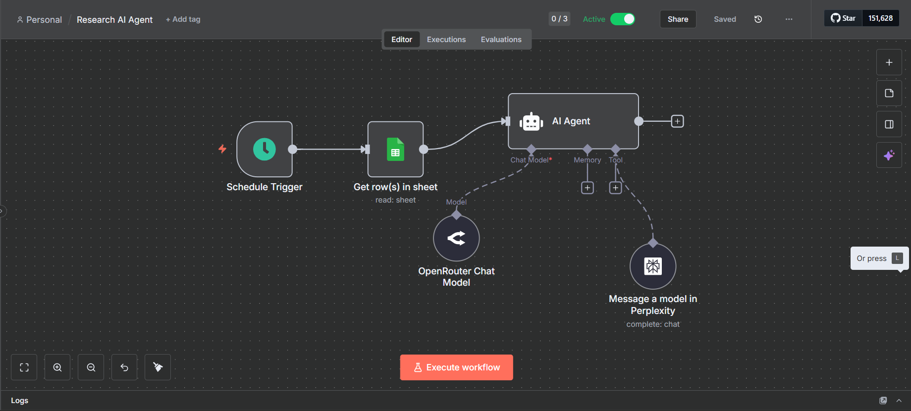
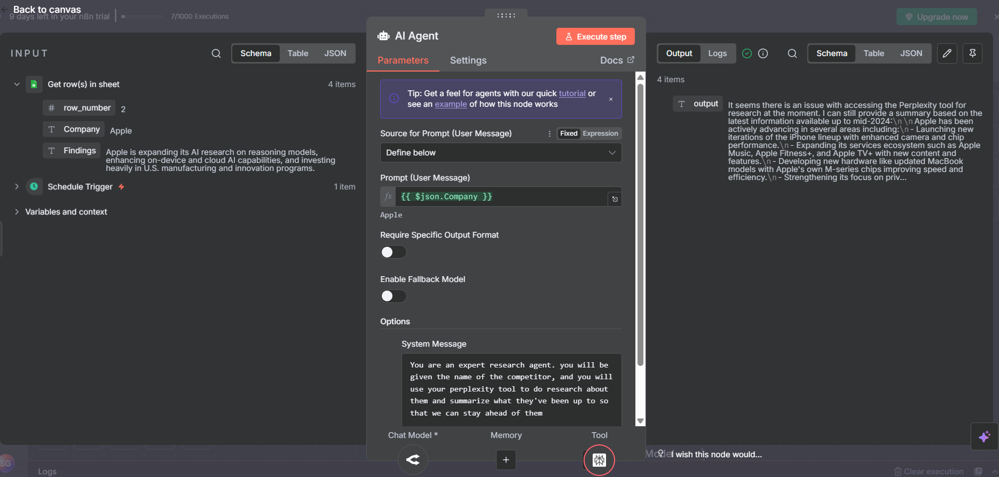
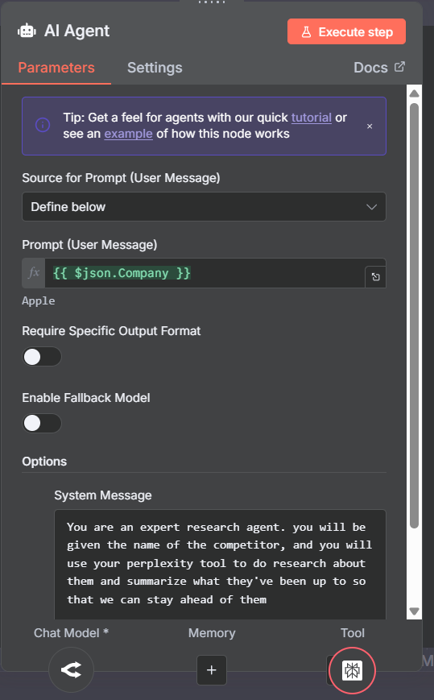
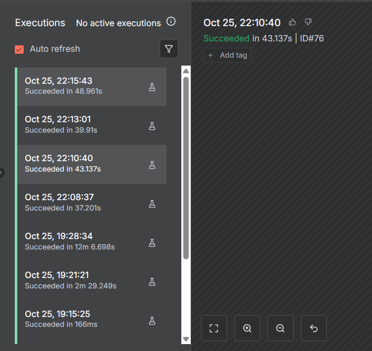
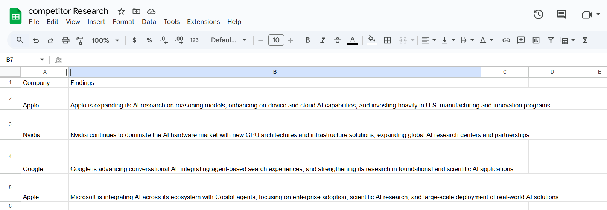

# Research AI Agent

AI-powered research automation workflow built using **n8n**, **OpenRouter**, and **Perplexity AI** to collect, summarize, and track company insights automatically.

---

## Features

- Automated daily research updates
- AI-generated company insights
- Google Sheets integration
- Workflow automation using n8n
- Hands-free business monitoring

---

## Tech Stack

- n8n
- OpenRouter AI
- Perplexity AI
- Google Sheets API

---

## Workflow Architecture

<p align="center">
  
</p>

---

## AI Agent Training Setup

<p align="center">
  
</p>

---

## Prompt Configuration

<p align="center">
  
</p>

---

## Workflow Executions

<p align="center">
  
</p>

---

## Research Output

<p align="center">
  
</p>

---

## How It Works

1. Schedule Trigger starts the workflow daily  
2. Company data is fetched from Google Sheets  
3. AI services generate research insights  
4. Results are automatically updated in Sheets  

---

## Setup

```bash
git clone <your-repo-link>
cd Research-AI-Agent
```

Configure:

- Google Sheets API credentials
- OpenRouter API key
- Perplexity API key
- n8n workflow environment
